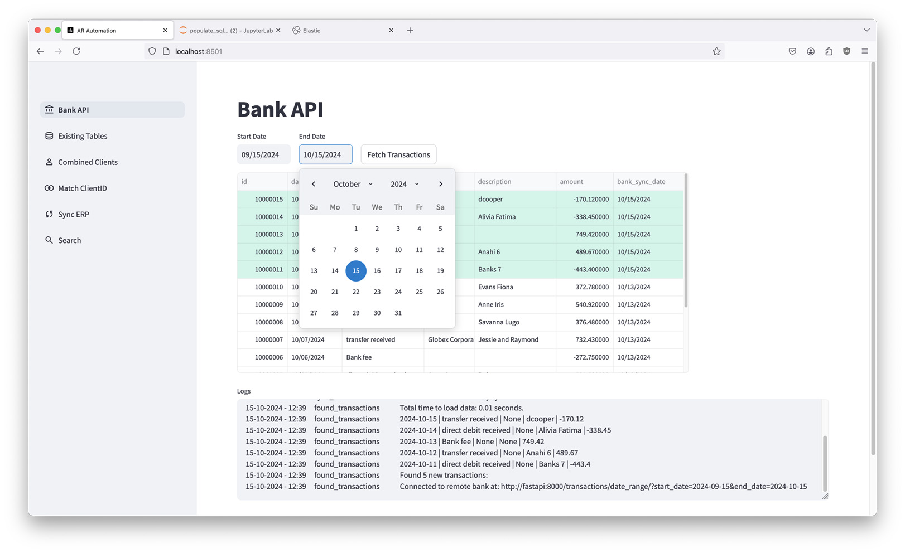

# Accounts Receivable Automation: Streamlit App


A Dockerized Streamlit app, that automates accounts receivable tasks. It's made with a modular design in mind to work alongside any Bank that has an API, and integrate with the company's existing legacy ERP/Client Information Systems requiring minimal or no changes to existing software.

## Cloning the Repository
```bash
git clone git@github.com:tbalza/accounts-receivable-automation.git
cd accounts-receivable-automation
```
## Launching the App
```bash
docker-compose up --build
```
## Components

**Streamlit**: Main app http://localhost:8501

**Jupyter**: Development notebooks http://localhost:8888

**Kibana**: UI for testing out Elasticsearch queries for ClientID matching http://localhost:5601

**FastAPI**: Demo bank endpoints http://localhost:8000/docs